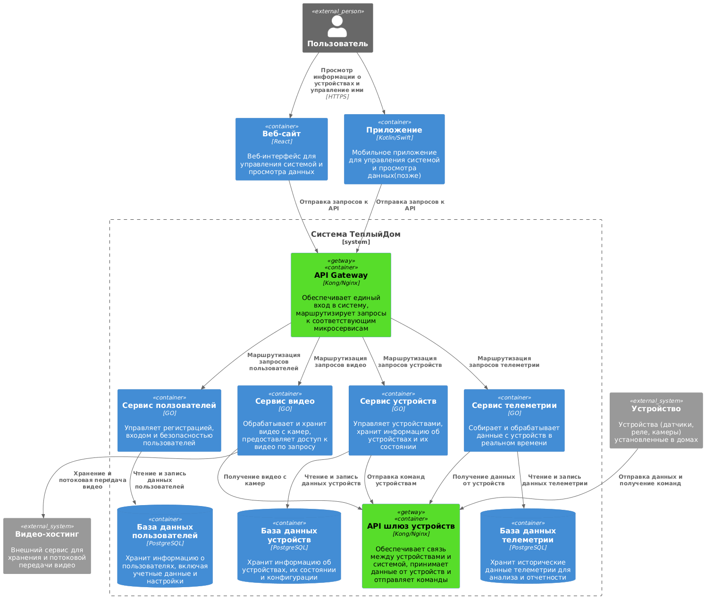
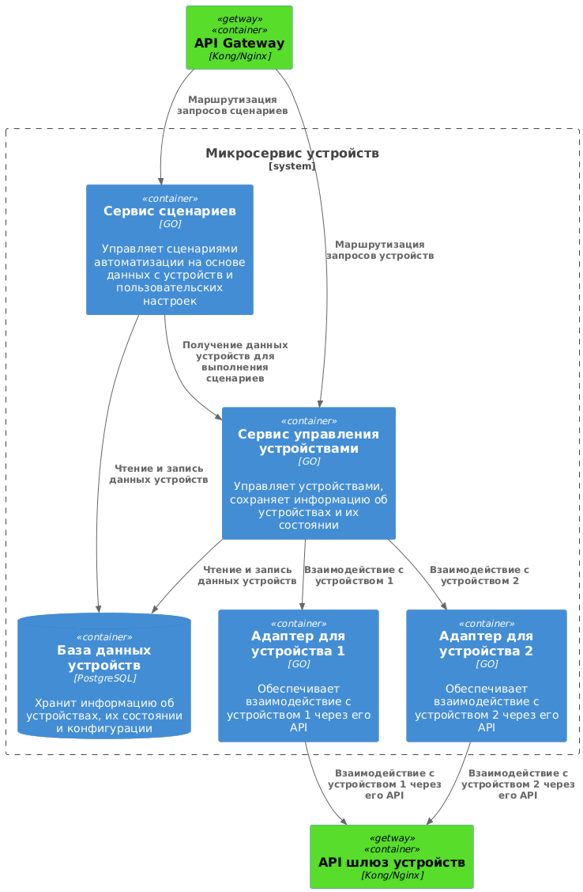
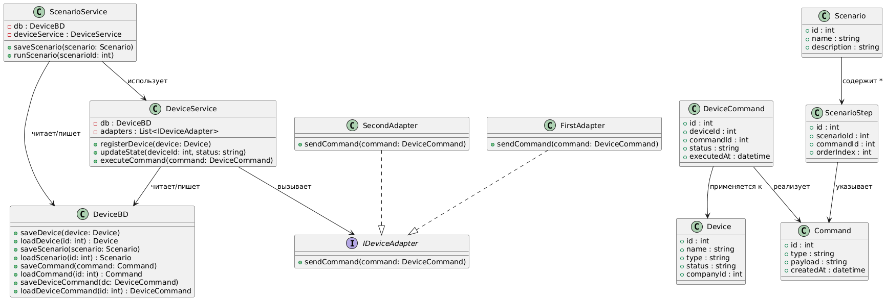
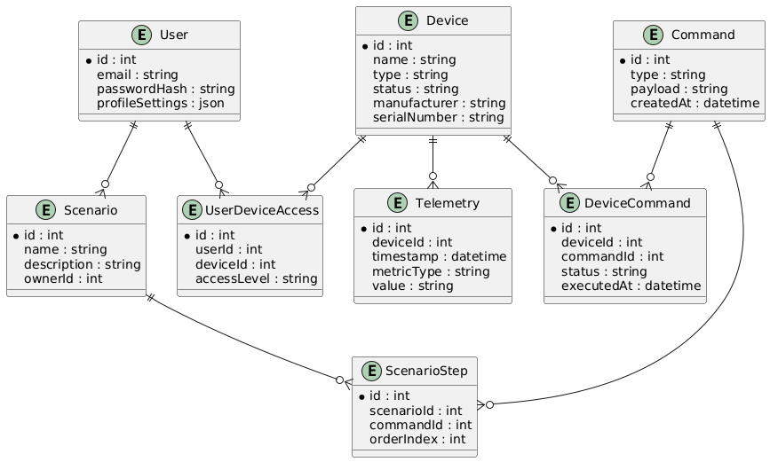

# Project_template

Это шаблон для решения проектной работы. Структура этого файла повторяет структуру заданий. Заполняйте его по мере работы над решением.

# Задание 1. Анализ и планирование

<aside>

Чтобы составить документ с описанием текущей архитектуры приложения, можно часть информации взять из описания компании и условия задания. Это нормально.

</aside

### 1. Описание функциональности монолитного приложения

**Управление отоплением:**

- Пользователи могут удаленно включать/выключать отопление в своих домах
- Система поддерживает управление температурой через веб-интерфейс

**Мониторинг температуры:**

- Пользователи могут просматривать текущую температуру в своих домах через веб-интерфейс
- Система поддерживает получение данных о температуре с датчиков, установленных в домах

### 2. Анализ архитектуры монолитного приложения

- Язык программирования: Go
- База данных: PostgesSQL
- Архитектура: Монолит, все в одном приложении
- Взаимодействие: Синхронное, запросы обрабатываются последовательно

### 3. Определение доменов и границы контекстов

- Домен Устройства(управление отоплением и просмотр температуры)
	* Поддомен управление температурой
	* Поддомен телеметрии
		+ Контекст сбора температуры с устройств
		+ Контекст отображения температуры
- Домен Пользователями(авторизация в web-клиент)
	* Поддомен управления пользователями
		+ Контекст аутентификации
		+ Контекст настроек аккаунта	

### **4. Проблемы монолитного решения**

- Маштабируемость: ограниченная, так как если мы захотим маштабировать одну из частей системы(например сбор данных по температуре), нам придется маштабировать весь монолит
- Развертывание: Нужно остановить все приложение, если мы хотим выкатить какие-то новые изменения 
- Разработка: Код тесно связан, из-за этого при разработке чего-то одного(например телеметрии) можем сломать другую часть кода
- Отказоустойчивость: при отказе монолита у нас откажет все приложение, а не отдельный его кусок
- Единая база данных: все хранится в одной базе, что замедляет работу приложения


### 5. Визуализация контекста системы — диаграмма С4


[Код схемы](/diagrams/monolit-context-diagram.puml)


# Задание 2. Проектирование микросервисной архитектуры

В этом задании вам нужно предоставить только диаграммы в модели C4. Мы не просим вас отдельно описывать получившиеся микросервисы и то, как вы определили взаимодействия между компонентами To-Be системы. Если вы правильно подготовите диаграммы C4, они и так это покажут.

**Диаграмма контейнеров (Containers)**




[Код схемы](diagrams/microservices-container-diagram.puml)

**Диаграмма компонентов (Components)**




[Код схемы](diagrams/microservices-components-diagram.puml)

**Диаграмма кода (Code)**




[Код схемы](diagrams/microservices-code-diagram.puml)

# Задание 3. Разработка ER-диаграммы




[Код схемы](diagrams/er-diagram.puml)

# Задание 4. Создание и документирование API

### 1. Тип API

Rest API для большинства запросов(хорошо походит для CRUD-операций), для телеметрии AsyncAPI(в этой ситуации немедленный ответ не нужен)

### 2. Документация API

[Swagger](schema/device-microservice.yml)

# Задание 5. Работа с docker и docker-compose

Перейдите в apps.

Там находится приложение-монолит для работы с датчиками температуры. В README.md описано как запустить решение.

Вам нужно:

1) сделать простое приложение temperature-api на любом удобном для вас языке программирования, которое при запросе /temperature?location= будет отдавать рандомное значение температуры.

Locations - название комнаты, sensorId - идентификатор названия комнаты

```
	// If no location is provided, use a default based on sensor ID
	if location == "" {
		switch sensorID {
		case "1":
			location = "Living Room"
		case "2":
			location = "Bedroom"
		case "3":
			location = "Kitchen"
		default:
			location = "Unknown"
		}
	}

	// If no sensor ID is provided, generate one based on location
	if sensorID == "" {
		switch location {
		case "Living Room":
			sensorID = "1"
		case "Bedroom":
			sensorID = "2"
		case "Kitchen":
			sensorID = "3"
		default:
			sensorID = "0"
		}
	}
```

2) Приложение следует упаковать в Docker и добавить в docker-compose. Порт по умолчанию должен быть 8081

3) Кроме того для smart_home приложения требуется база данных - добавьте в docker-compose файл настройки для запуска postgres с указанием скрипта инициализации ./smart_home/init.sql

Для проверки можно использовать Postman коллекцию smarthome-api.postman_collection.json и вызвать:

- Create Sensor
- Get All Sensors

Должно при каждом вызове отображаться разное значение температуры

Ревьюер будет проверять точно так же.


